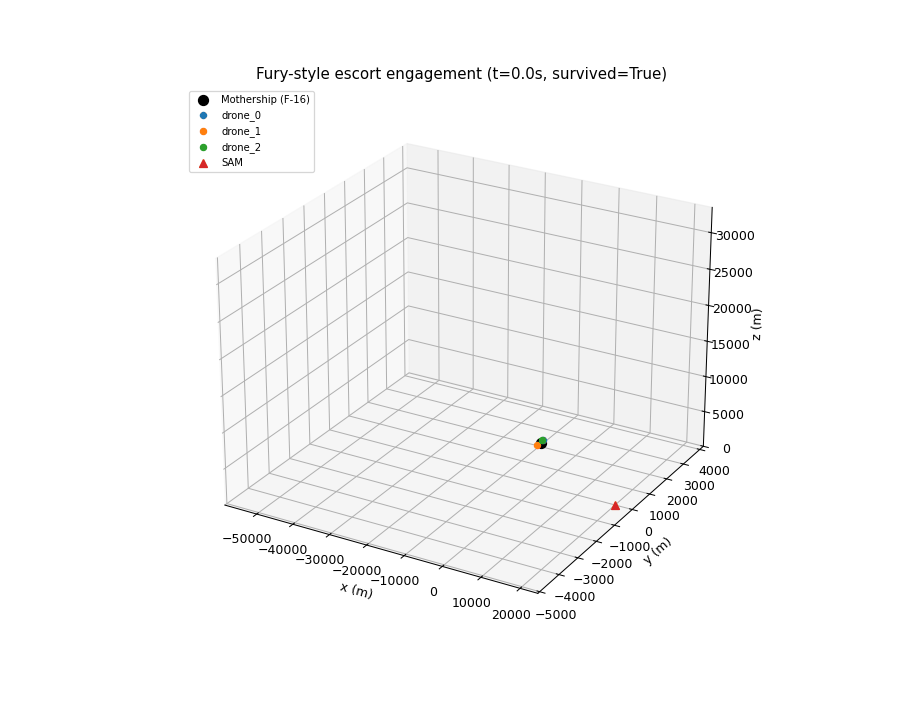
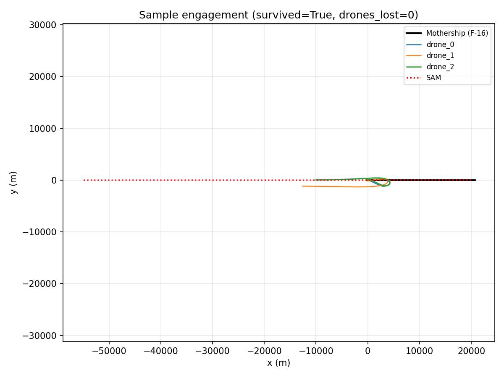
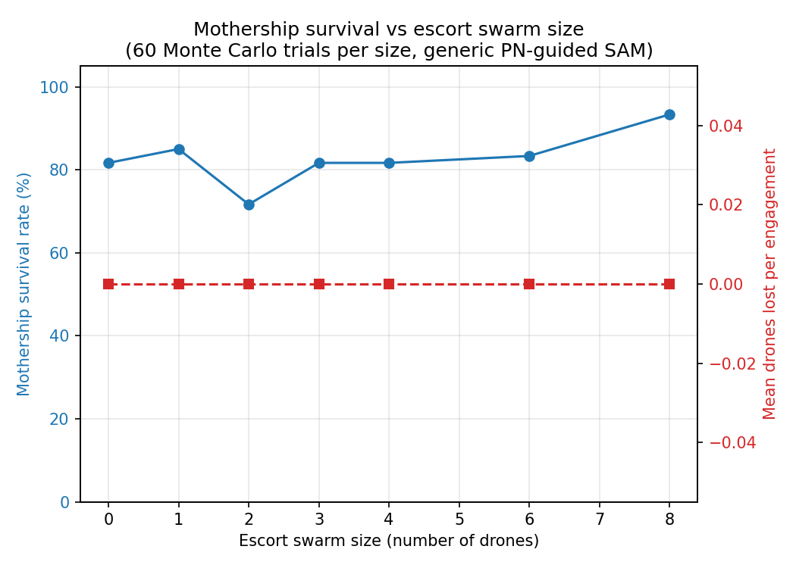

# Fury Style Escort Swarm Engagement Simulation

A simulation testbed for studying whether an autonomous escort drone swarm
improves the survivability of a manned strike aircraft against a single
surface to air missile shot, and how that effect scales with swarm size and
role allocation. The manned aircraft (the "mothership") is flown with the
same nonlinear F 16 flight dynamics model used for the verification
benchmark this project is built on, so the ingress trajectory this study
relies on is not a simplified stand in.



Black marker and trail: the mothership. Colored markers: escort drones. Red
triangle: the inbound SAM. In the clip above, the escort drone closes to
intercept range and neutralizes the missile before it reaches the
mothership. The text overlay in the final frames states the actual outcome
explicitly, since at this simulation's scale an intercepted SAM and an
actual hit on the mothership can otherwise look nearly identical.

## Research question

Given a fixed missile threat and a fixed ingress profile, does adding escort
drones in defined roles (decoy, jammer, hard kill interceptor) change the
probability that the mothership survives, and is there a point of
diminishing or negative returns as swarm size grows?

## Model summary

| Entity          | Dynamics model                                                   | Fidelity |
|------------------|-------------------------------------------------------------------|----------|
| Mothership       | Full 13 state nonlinear F 16 model (this repository's AeroBenchVV benchmark), LQR inner loop, waypoint outer loop autopilot | Nonlinear ODE, integrated with `scipy.integrate.RK45` |
| Escort drones    | Energy state / bank to turn point mass model | Reduced order, closed form update |
| SAM              | Proportional navigation guidance (Zarchan, *Tactical and Strategic Missile Guidance*), generic seeker with field of view, range, and lock/jam probability | Reduced order, textbook guidance law |

The mothership deliberately gets the higher fidelity treatment: this study
is about the survivability of that one aircraft, so its trajectory comes
from the same validated nonlinear model used for the verification work
described below, rather than a simplified approximation. None of these
models represent the seeker, airframe, or guidance parameters of any
specific real world system.

## Sample results

From a 60 trial per swarm size Monte Carlo sweep, SAM launched at 20 km,
offset uniformly between -25 and +25 degrees off nose on:

| Escort drones | Survival rate | Mean miss distance (m) |
|---------------|---------------|--------------------------|
| 0             | 0.82          | 31.6 |
| 1             | 0.85          | 28.4 |
| 2             | 0.72          | 27.3 |
| 3             | 0.82          | 63.0 |
| 4             | 0.82          | 64.3 |
| 6             | 0.83          | 61.0 |
| 8             | 0.93          | 75.7 |

These numbers vary between runs since trial seeds are not fixed in the
sweep; treat this table as illustrative of the kind of output the harness
produces, not as a final result.




## Running it

```
cd fury_sim
python run_experiment.py         # Monte Carlo sweep across swarm sizes
python animate_engagement.py     # renders one engagement as a 3D GIF
```

Both scripts depend only on `numpy`, `scipy`, `matplotlib`, `pandas`, and
`Pillow`. No separate install step is needed for the underlying F 16 model:
the mothership wrapper adds `code/` to `sys.path` at import time.

Full documentation, including the file layout, animation options, how to
read the outcome labels, and known modeling limitations, is in
[`fury_sim/README.md`](fury_sim/README.md).

## Credits

This project is a swarm engagement study built on top of **AeroBenchVV**,
the F 16 verification benchmark that makes up the rest of this repository
(the `code/` directory). All flight dynamics used here, including the
mothership's full nonlinear model, come from that benchmark unmodified in
its core aerodynamics; only a thin wrapper (`fury_sim/f16_mothership.py`)
was added to drive it from this simulation.

AeroBenchVV is the work of Stanley Bak and collaborators, ported to Python
from the original MATLAB benchmark. For citation purposes, please use:

> "Verification Challenges in F-16 Ground Collision Avoidance and Other
> Automated Maneuvers", P. Heidlauf, A. Collins, M. Bolender, S. Bak, 5th
> International Workshop on Applied Verification for Continuous and Hybrid
> Systems (ARCH 2018)

Original MATLAB benchmark: https://github.com/pheidlauf/AeroBenchVV
Original Python port: https://github.com/stanleybak/AeroBenchVVPython

---

## AeroBenchVV benchmark (underlying project)

<p align="center">  </p>

This is the v2 branch of the AeroBenchVV benchmark, a python3 project with
modularity and general simulation capabilities beyond the original paper
version (see the v1 branch for that). It contains a python version of
models and controllers that test automated aircraft maneuvers by performing
simulations. The hope is to provide a benchmark to motivate better
verification and analysis methods, working beyond models based on Dubins
car dynamics, towards the sorts of models used in aerospace engineering.
Roughly speaking, the dynamics are nonlinear, have about 10-20 dimensions
(continuous state variables), and hybrid in the sense of discontinuous
ODEs, but not with jumps in the state.

### Required libraries

The following Python libraries are required (can be installed using `pip
install <library>`):

`numpy`, for matrix operations.

`scipy`, for simulation and numerical integration (RK45) and trim condition
optimization.

`matplotlib`, for animation and plotting (requires `ffmpeg` for `.mp4`
output; `.gif` output uses matplotlib's built in Pillow writer).

`slycot`, for control design (not needed for simulation).

`control`, for control design (not needed for simulation).

### Animation issues

Use matplotlib version 3.1.1 if you get errors like:

```
"art3d.py", line 175, in set_3d_properties
    zs = np.broadcast_to(zs, xs.shape)
AttributeError: 'list' object has no attribute 'shape'
```

### Release documentation

Distribution A: Approved for Public Release (88ABW-2020-2188) (changes in this version)

Distribution A: Approved for Public Release (88ABW-2017-6379) (v1)
